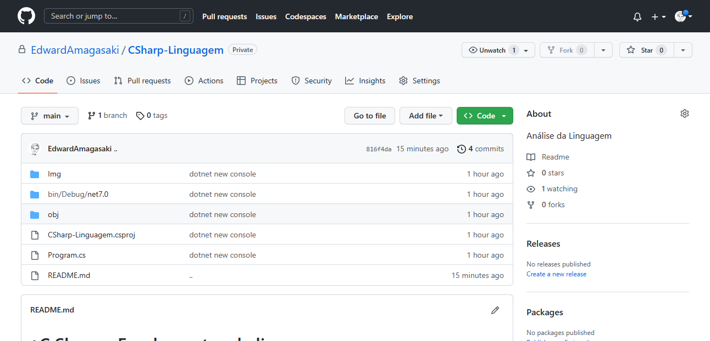

# C Sharp - Fundamentos da linguagem

De acordo com a documentação do software a linguagem C# enfatiza o controle de versão para garantir que programas e bibliotecas possam evoluir ao longo do tempo de maneira compatível. Aspectos do design do C# que foram diretamente influenciados pelas considerações de controle de versão incluem os
modificadores separados virtual e override, as regras de resolução de sobrecarga de método e suporte para declarações explícitas de membro de interface.

Dentro do VS Code e já com o nosso controle de versão de software sincronizado, iremos refazer o caminho que percorremos até esse ponto. 

Primeiramente, criamos o repositório no GitHub.

em seguida, incluimos o seguinte código:

```
git clone https://github.com/EdwardAmagasaki/CSharp-Linguagem.git
cd CSharp-Linguagem
code .
```
Dentro do VCS Code, já podemos abrir o arquivo README.md e iniciar o desenvolvimento do código com o controle de versão sincronizado.


Para maiores informações e lista de dicas sobre o GitHub, acesse o repositório: 
https://github.com/EdwardAmagasaki/gitInicial

Vamos realizar o primeiro commit do projeto.

Ao sincronizar, podemos verificar o nosso novo repositório atualizado, veremos a imagem abaixo:


O C# Sharp é uma linguagem orientada a objetos e também a componentes. Também é fortemente tipada, onde definimos o tipo e o comportamento dos objetos. 

Agora vamos escrever nosso primeiro código em c# Sharp. Pediremos para que a aplicação imprima no nosso terminal a mensagem Olá Mundo!

```
dotnet new console
```
Vamos incluir o código abaixo dentro do arquivo Program.cs :
```
using System;
class Ola
{
    static void Main()
    {
        Console.WriteLine("Olá, Mundo");
    }
}

```
using na primeira linha é um diretiva c# sharp que faz referência a namespace System. Namespaces fornecem um meio hierárquico de organizar bibliotecas e programas em C# e é através dessa diretiva que o programa pode utilizar o commando: Console.WriteLine("Ola,Mundo"), pois está dentro do namespace System.

Por exemplo, para o MVC, a diretiva e a referência para a namespace são: using System.Net.Mvc para ASP.NET, e o : Microsoft.AspNetCore.Mvc ASP.NET CORE.

Digitamos então dotnet run e obtemos o resultado conforme a imagem abaixo:


Pronto! Vamos atualizar novamente o nosso repositório, para que a qualquer momento possamos reabri-lo e dar 
uma sequência a evolução do projeto.

