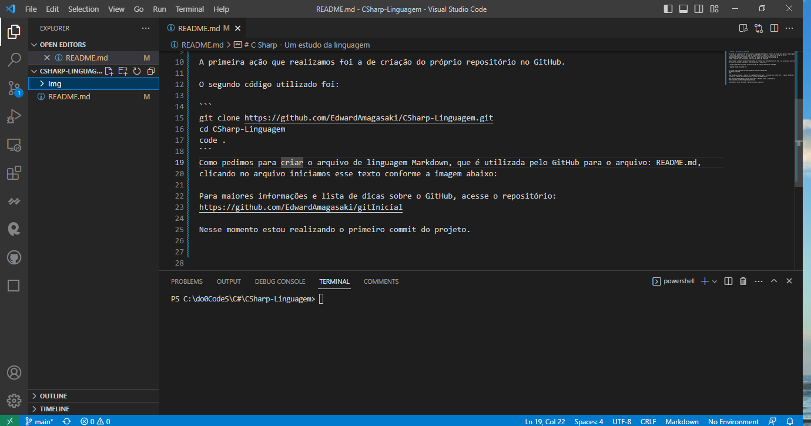
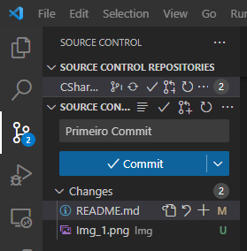
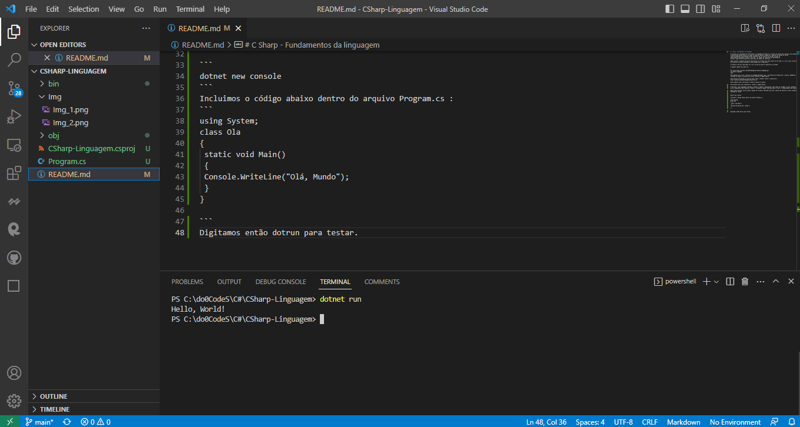

# C Sharp - Fundamentos da linguagem

De acordo com a documentação da Microsoft a linguagem C# enfatiza o controle de versão para garantir que programas e bibliotecas possam evoluir ao longo do tempo de maneira compatível. Aspectos do design do C# que
foram diretamente influenciados pelas considerações de controle de versão incluem os
modificadores separados virtual e override , as regras de resolução de sobrecarga de
método e suporte para declarações explícitas de membro de interface.

Vamos refazer o caminho que percorremos antes de criarmos esse texto dentro do VS Code e já com o nosso controle de versão de software escolhido e sincronizado com o repositório.

A primeira ação que realizamos foi a de criação do próprio repositório no GitHub.

O segundo código utilizado foi:

```
git clone https://github.com/EdwardAmagasaki/CSharp-Linguagem.git
cd CSharp-Linguagem
code .
```
Como pedimos para criar o arquivo de linguagem Markdown, que é utilizada pelo GitHub para o arquivo: README.md,
clicando no arquivo iniciamos esse texto conforme a imagem abaixo:



Para maiores informações e lista de dicas sobre o GitHub, acesse o repositório: 
https://github.com/EdwardAmagasaki/gitInicial

Nesse momento estou realizando o primeiro commit do projeto.

Verificando nosso novo repositório, veremos a imagem abaixo:

O C# Sharp é uma linguagem orientada a objetos e também a componentes, onde temos por exemplo o nosso: WebForms e outros componentes mais modernos. Também é fortemente tipada, onde definimos o tipo e o comportamento dos objetos. 

Agora vamos escrever nosso primeiro código em c# Sharp. Pediremos para que a aplicação imprima no nosso terminal a mensagem Olá Mundo!

```
dotnet new console
```
Incluimos o código abaixo dentro do arquivo Program.cs :
```
using System;
class Ola
{
    static void Main()
    {
        Console.WriteLine("Olá, Mundo");
    }
}

```
using na primeira linha é um diretiva c# sharp que faz referência a namespace System. Namespaces fornecem um meio hierárquico de organizar bibliotecas e programas em C# e é através dessa diretiva que o programa pode utilizar o commando: Console.WriteLine("Ola,Mundo"), pois está dentro do namespace System.

Se fossemos por exemplo utilizar o MVC, utilizariamos a diretiva e a referência para a namespace correspondente.

Digitamos então dotnet run e obtemos o resultado conforme a imagem abaixo:

Pronto! Vamos atualizar novamente o nosso repositório, para que a qualquer momento possamos reabri-lo e dar 
uma sequência a evolução do projeto.